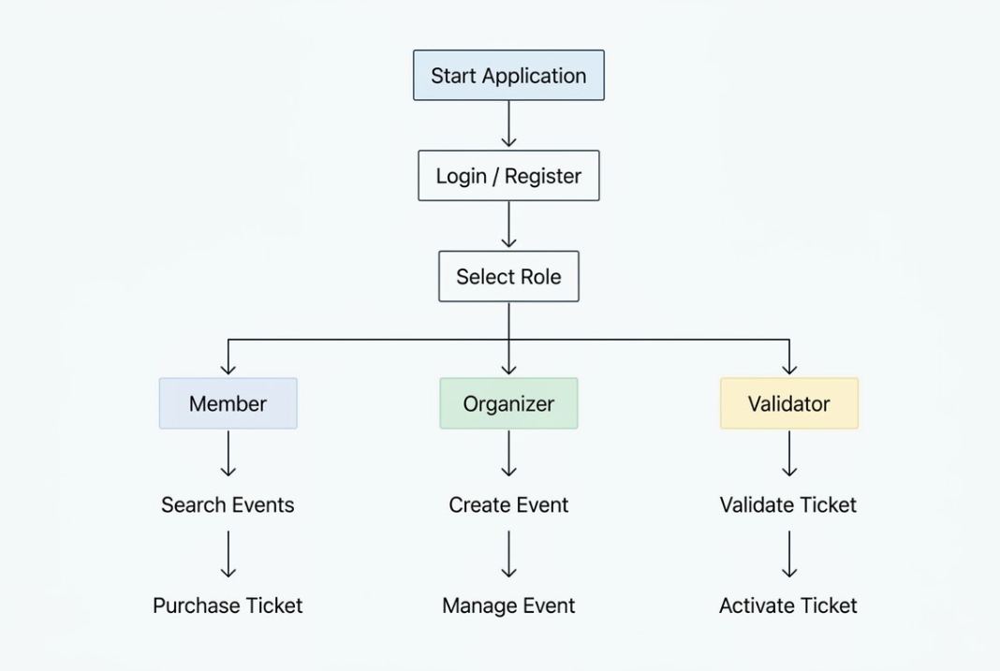

# Event-Manager
Event-Manager is a Java-based console application for managing events, users, tickets, and ticket validation.
The project is focused on applying core object-oriented programming principles to a practical event management system. The application provides different user roles and allows users to create, manage, purchase, search for, and validate event tickets.

## Tech Stack

- **Java**, **Object-Oriented Programming (OOP)**, **Java Collections Framework**, **CSV**, **Git & GitHub** — Version control and source code management

# Application Architecture

The project uses an object-oriented design with clear responsibilities for each part of the application.

```text
                    Event-Manager
                       |
        ┌──────────────┼──────────────┐
        │              │              │
      Users          Events         Tickets
        │              │              │
   ┌────┼────┐         │         ┌────┼────┐
   │    │    │         │         │    │    │
Member Organizer Validator   Individual Group Family
```

## Features

### 1. User Management

- User registration and login
- Different user roles:
  - **Member** – can browse events and purchase tickets
  - **Organizer** – can create and manage events
  - **Validator** – can validate and activate tickets
- Role-based access to application functionality

### 2. Event Management

- Create and manage events
- Store event information such as:
  - Event name, Location, Date and time, Description, Available tickets
- Search for active events by:
  - Location, Date range, Partial event name

### 3. Ticket Management

The application supports multiple ticket types: Individual, Group and Family tickets

Users can:

- Purchase tickets
- View purchased tickets
- Track ticket status
- Validate and activate tickets

### 4. Ticket Validation

Validators can check tickets and change their status when they are used for an event.

The validation system helps prevent invalid or inactive tickets from being used.

## Data 

Event-Managere uses **CSV files** to store and load users, events, and ticket data.

## Object-Oriented Programming

One of the main goals of Event-Manager is to demonstrate practical use of Java OOP principles.

The project uses:

- **Classes and Objects**
- **Inheritance**
- **Abstract Classes**
- **Interfaces**
- **Enums**
- **Encapsulation**
- **Polymorphism**
- **Method Overriding**
- **Collections**
- **Exception Handling**

# Getting Started

## 1. Prerequisites

Before running **Java JDK 17 or later** needed to be installed :

## 2. Clone the Repository and run app

```bash
git clone <repository-url>
```
## Application Flow

A typical application flow looks like this:


# Future Development

Future development could expand the application with more advanced features and technologies.

- **Database Integration** — Replace CSV files with a relational database such as MySQL.
- **REST API** — Add a REST API to allow the application to communicate with web or mobile clients.
- **Web Interface** — Replace the console interface with a modern web application like React or Angular.
- **Improved Authentication** — Add secure password hashing, authentication, and role-based authorization.
- **QR Code Tickets** — Generate QR codes for tickets and allow validators to scan them.
- **Automated Testing** — Add unit and integration tests using JUnit and Mockito.
- **Improved Error Handling** — Provide better validation and user-friendly error messages.
- **Logging** — Add structured logging to make debugging and monitoring easier.
- **Event Filtering** — Add more advanced filtering and sorting options for events.
- **Admin Dashboard** — Introduce an administrator role for managing users, events, and tickets.
